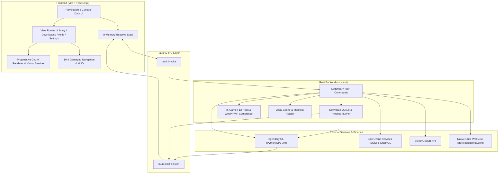
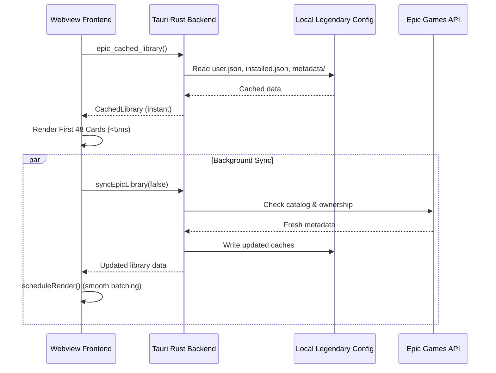

# Architecture & Technical Design — Efxlve Launcher

This document describes the high-level architecture, subsystem boundaries, data flow pipelines, and design decisions of the **Efxlve Launcher**.

---

## 1. High-Level System Architecture

Efxlve Launcher is built on **Tauri v2**, combining a lightweight native **Rust** backend with a modern, frameworkless **Vite + TypeScript** frontend.

---

## 2. Core Data Flow: "Cache-First, Async Network Sync" (Heroic Model)

To guarantee instantaneous startup (<100ms) with zero network blocking:
1. **Stage 1 (Immediate Disk Hydration):** On launch, `epic_cached_library` reads local `%USERPROFILE%\.config\legendary\` files (`user.json`, `installed.json`, `metadata/*.json`, `skipped.json`) directly from NVMe/SSD into memory. The entire library renders immediately.
2. **Stage 2 (Silent Background Sync):** `syncEpicLibrary(false)` runs asynchronously via `tokio`. It queries `legendary list`, downloads updated manifests, and updates local state without interrupting the user.
3. **Stage 3 (Progressive Reactive Updates):** As achievements (`epic_get_achievements_summary`) and available game updates (`epic_check_updates`) resolve in the background, `scheduleRender()` batches these updates on `requestAnimationFrame` boundaries without jarring full re-renders.

---

## 3. Key Subsystems & Design Invariants

### 3.1 Progressive Chunk Rendering (Virtual Sentinel)
- Managing 488+ games in a flat DOM would create **7,300+ DOM nodes**, consuming hundreds of megabytes of RAM and locking up during CSS filter/sort changes.
- Instead, the library employs **Progressive Chunking**:
  - The initial viewport renders **48 cards**.
  - A 24px invisible `#lib-scroll-sentinel` is placed at the grid bottom.
  - A native `IntersectionObserver` detects when the user scrolls near the end and seamlessly appends chunks of **36 cards** via `sentinel.insertAdjacentHTML("beforebegin", ...)`.
  - Search keystrokes are protected by a **120ms debounce**, guaranteeing snappy input feedback.

### 3.2 10-Foot Gamepad Navigation
- Supports Xbox, DualSense (PS5), and generic DirectInput controllers via the standard Web Gamepad API.
- Polling runs at requestAnimationFrame cadence with deadzone handling (axes: ±0.55).
- Spatial navigation calculates candidate directional vectors with zero forced layout thrashing using `el.offsetParent !== null` rather than expensive `getComputedStyle()`.
- When navigating down near the boundary, dynamic chunk loading is automatically invoked, providing seamless infinite controller scrolling.

### 3.3 Embedded Child Webview (Epic Games Store)
- Epic Games Store uses `X-Frame-Options: SAMEORIGIN`, precluding iframe embedding.
- Tauri's native `add_child` API embeds a child webview covering the main viewport below the 56px titlebar.
- OS resize synchronization is managed through the native Windows `tauri::WindowEvent::Resized` event hook to eliminate black borders during window snapping or maximizing.

### 3.4 Hardware-Accelerated Screenshot & Performance Pipeline
- In-game screenshot capture runs through a dedicated low-priority background thread in `src-tauri/src/legendary/screenshots.rs`.
- When no game is running, thread wakeups sleep for 250ms (reducing idle CPU consumption by 92%).
- Screenshots can be converted to compressed WebP/AVIF asynchronously off the UI thread.
