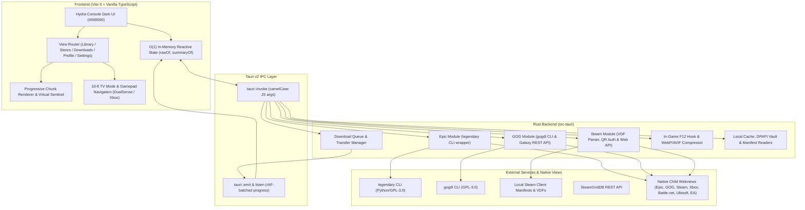
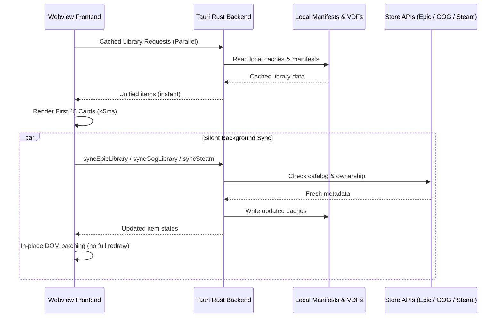

# Architecture & Technical Design — Efxlve Launcher

This document describes the high-level architecture, subsystem boundaries, data flow pipelines, and design decisions of **Efxlve Launcher** as a Universal Gaming Hub.

---

## 1. High-Level System Architecture

Efxlve Launcher is built on **Tauri v2**, combining a lightweight native **Rust** backend with a frameworkless **Vanilla TypeScript (Vite 6)** frontend.

```mermaid
graph TD
    subgraph Frontend ["Frontend (Vite 6 + Vanilla TypeScript)"]
        UI["Hydra Console Dark UI (#000000)"]
        Router["View Router (Library / Stores / Downloads / Profile / Settings)"]
        PChunk["Progressive Chunk Renderer & Virtual Sentinel"]
        GamepadMgr["10-ft TV Mode & Gamepad Navigation (DualSense / Xbox)"]
        State["O(1) In-Memory Reactive State (rawOf, summaryOf)"]
    end

    subgraph IPC ["Tauri v2 IPC Layer"]
        Invoker["tauri::invoke (camelCase JS args)"]
        Events["tauri::emit & listen (rAF-batched progress)"]
    end

    subgraph Backend ["Rust Backend (src-tauri)"]
        EpicCmds["Epic Module (legendary CLI wrapper)"]
        GogCmds["GOG Module (gogdl CLI & Galaxy REST API)"]
        SteamCmds["Steam Module (VDF Parser, QR Auth & Web API)"]
        Transfers["Download Queue & Transfer Manager"]
        Screenshots["In-Game F12 Hook & WebP/AVIF Compressor"]
        CacheMgr["Local Cache, DPAPI Vault & Manifest Readers"]
    end

    subgraph External ["External Services & Native Views"]
        LegendaryCLI["legendary CLI (Python/GPL-3.0)"]
        GogdlCLI["gogdl CLI (GPL-3.0)"]
        SteamLocal["Local Steam Client Manifests & VDFs"]
        SteamGrid["SteamGridDB REST API"]
        StoreWVs["Native Child Webviews (Epic, GOG, Steam, Xbox, Battle.net, Ubisoft, EA)"]
    end

    UI --> Router
    Router --> PChunk
    Router --> GamepadMgr
    UI --> State
    State <--> Invoker
    Events --> State

    Invoker --> EpicCmds
    Invoker --> GogCmds
    Invoker --> SteamCmds
    Invoker --> Transfers
    Invoker --> CacheMgr
    Invoker --> Screenshots

    EpicCmds --> LegendaryCLI
    EpicCmds --> StoreWVs
    GogCmds --> GogdlCLI
    GogCmds --> StoreWVs
    SteamCmds --> SteamLocal
    SteamCmds --> StoreWVs
    Transfers --> Events
```

---

## 2. Core Data Flow: "Cache-First, Async Network Sync" (Heroic Model)

To guarantee instantaneous startup (<100ms) with zero network blocking:
1. **Stage 1 (Immediate Disk Hydration):** On launch, `epic_cached_library`, `gog_cached_library`, and local Steam manifests are read directly from local disk caches (`%USERPROFILE%\.config\legendary\`, `gogdl\`, and Steam `appcache/` / `steamapps/`). The entire unified library renders immediately without waiting for any network response.
2. **Stage 2 (Silent Background Sync):** Asynchronous background tasks query `legendary list`, GOG Galaxy endpoints, and Steam ownership APIs, updating caches and applying deltas without interrupting the user.
3. **Stage 3 (Progressive Reactive Updates):** As achievements, playtime, and game updates resolve in the background, targeted DOM updates are applied to the active cards/buttons without full-page re-renders.

```mermaid
sequenceDiagram
    participant UI as Webview Frontend
    participant Rust as Tauri Rust Backend
    participant Disk as Local Manifests & VDFs
    participant Remote as Store APIs (Epic / GOG / Steam)

    UI->>Rust: Cached Library Requests (Parallel)
    Rust->>Disk: Read local caches & manifests
    Disk-->>Rust: Cached library data
    Rust-->>UI: Unified items (instant)
    UI->>UI: Render First 48 Cards (<5ms)

    par Silent Background Sync
        UI->>Rust: syncEpicLibrary / syncGogLibrary / syncSteam
        Rust->>Remote: Check catalog & ownership
        Remote-->>Rust: Fresh metadata
        Rust->>Disk: Write updated caches
        Rust-->>UI: Updated item states
        UI->>UI: In-place DOM patching (no full redraw)
    end
```

---

## 3. Key Subsystems & Design Invariants

### 3.1 Progressive Chunk Rendering (Virtual Sentinel)
- Managing 500+ games in a flat DOM would create **7,000+ DOM nodes**, consuming significant RAM and causing frame drops during filtering and sorting.
- Instead, the library employs **Progressive Chunking**:
  - The initial viewport renders **48 cards**.
  - A 24px invisible `#lib-scroll-sentinel` is placed at the grid bottom.
  - A native `IntersectionObserver` detects when the user scrolls near the end and seamlessly appends chunks of **36 cards** via `sentinel.insertAdjacentHTML("beforebegin", ...)`.
  - Search keystrokes are protected by a **120ms debounce**, guaranteeing snappy input feedback.

### 3.2 10-Foot TV Mode & Gamepad Navigation
- Supports Xbox, DualSense (PS5), and generic DirectInput controllers via the standard Web Gamepad API.
- Dedicated TV Mode (`src/features/gamepad/tv-mode.ts`, `src/styles/tv-mode.css`) optimized for couch gaming.
- Polling runs at requestAnimationFrame cadence with deadzone handling (axes: ±0.55).
- Spatial navigation calculates candidate directional vectors with zero forced layout thrashing using `el.offsetParent !== null` rather than expensive `getComputedStyle()`.

### 3.3 Embedded Child Webviews (Multi-Storefront)
- 7 embedded store views: Epic Games, GOG.COM, Steam, Xbox (PC-filtered), Battle.net, Ubisoft, and EA.
- Built via Tauri's native `WebviewBuilder::new(...)` using the `unstable` feature flag and `window.add_child`.
- OS resize synchronization is managed through the native Windows `tauri::WindowEvent::Resized` event hook to eliminate black borders during window snapping or maximizing.
- **Rule:** Never pass `additional_browser_args` to `WebviewBuilder`, as it silently breaks child webview rendering in WebView2.

### 3.4 Hardware-Accelerated Screenshot Hook
- In-game screenshot capture runs through a dedicated low-priority background thread in `src-tauri/src/legendary/screenshots.rs`.
- When no game is running, thread wakeups sleep for 250ms (reducing idle CPU consumption by 92%).
- Screenshots can be converted to compressed WebP/AVIF asynchronously off the UI thread.
