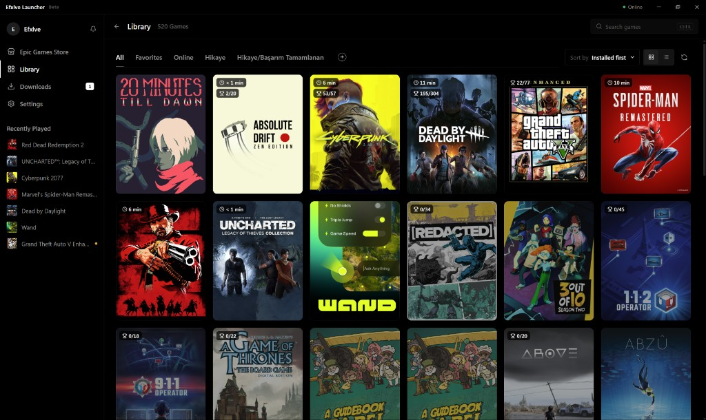
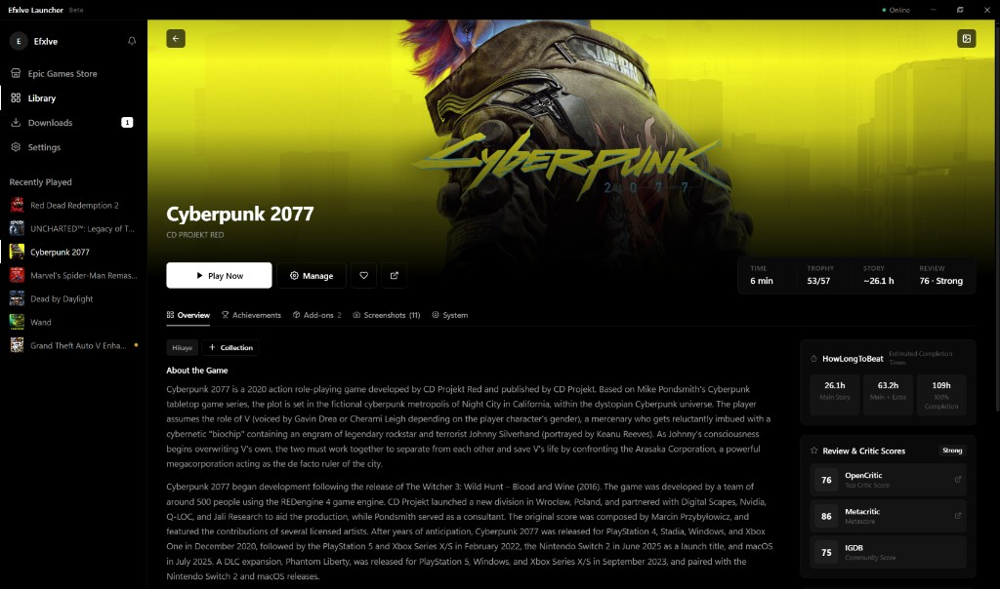
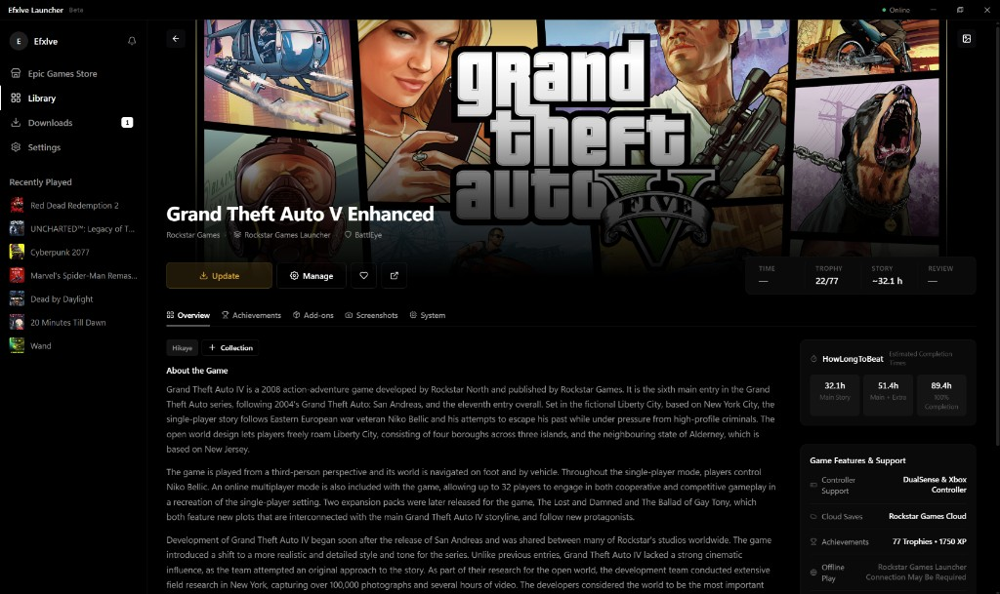
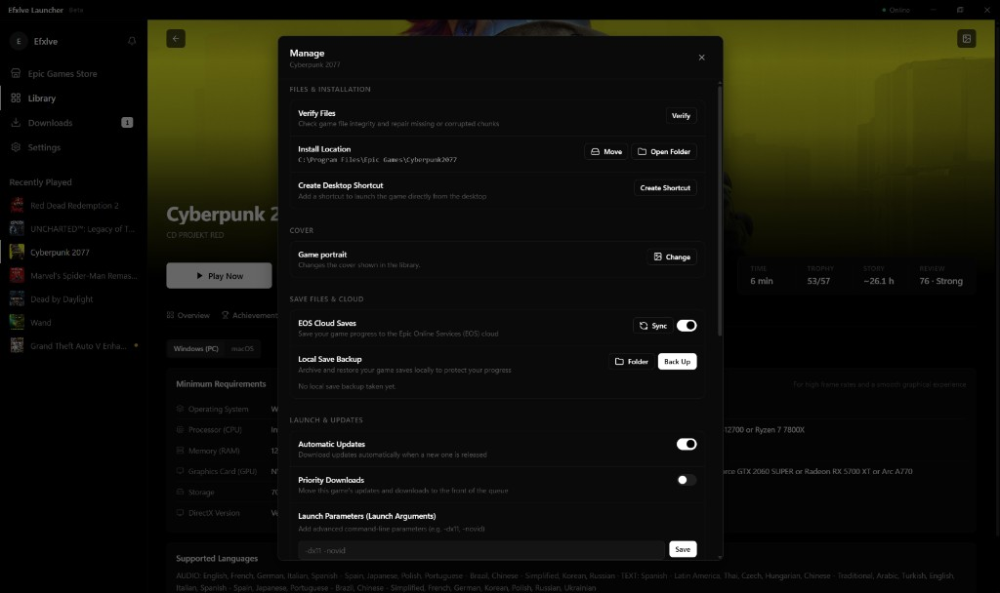
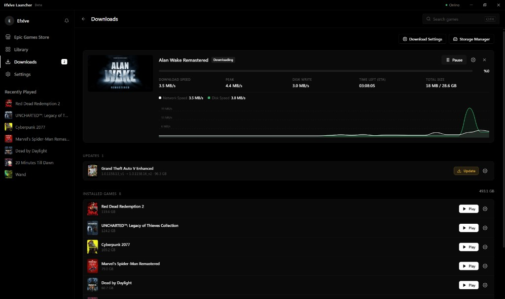
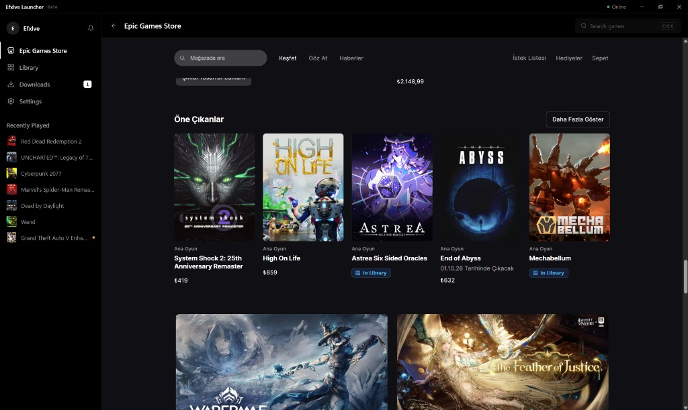
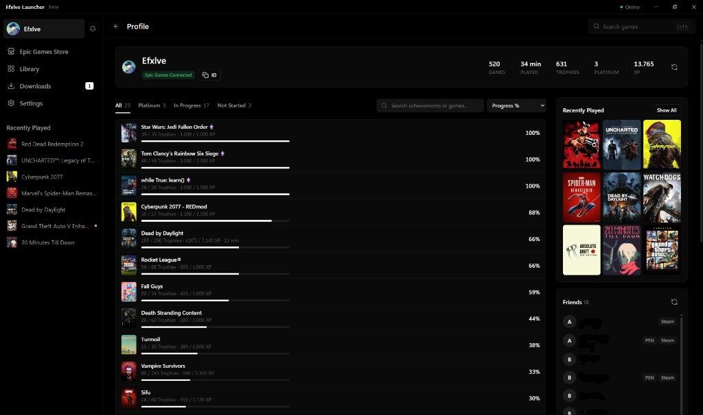

# Efxlve Launcher

<p align="center">
  
</p>

<p align="center">
  A desktop launcher for an Epic Games library on Windows.<br>
  Tauri 2, Rust, and TypeScript. No UI framework.
</p>

<p align="center">
  
  
</p>

Efxlve opens from the library already saved on disk, so the window does not wait on the network. A sync still runs in the background. Installs, updates, and launches go through [legendary](https://github.com/legendary-gl/legendary).

## Download

The current release is **0.1.12**.

1. Open the [latest release](https://github.com/efxlve/efxlve_launcher/releases/latest). The [v0.1.12](https://github.com/efxlve/efxlve_launcher/releases/tag/v0.1.12) page is the same build.
2. Download the Windows setup. It is the `.exe` installer. Leave the `.msi` alone.
3. Run that setup. You need Windows 10 or 11, 64-bit. WebView2 is required, and Windows 11 already has it.

Windows is the release you can install today. Linux and macOS are coming soon.

Once it is installed, the launcher can update itself.



This is the library: covers, with playtime and achievement progress on them. Search, filters, collections, and sort are on the same row. There is a list view too, if you would rather read titles than scan covers. Games you have not installed stay in the grid.

## Game page

Open a game and you can play it, or update it when a newer build is waiting. The page also shows time played, trophies, how long the story tends to take, and review scores. Under that you can read the description, achievements, add-ons, screenshots, and system requirements.



Under the title you can see the studio, and when it matters, the launcher or anti-cheat the game needs. If an update is waiting, the button says Update.



Manage opens in its own window. From there you can check the files, move the install, open the folder, add a desktop shortcut, change the cover, sync cloud saves, keep a local backup, and set launch arguments.



## Downloads

While a download is running you can see the speed, how fast it is writing to disk, the size, and how long is left. A small graph shows the recent speed. Updates for games you already have are listed under that, and installed games stay on the same page so you can start them from here.



You can pause and continue later. The files already downloaded stay. Close the window during a download and the launcher goes to the tray instead of stopping the transfer. Before a new game starts, you choose the folder. If the game is already on a disk, including a portable one, you can scan that folder and add it. Rockstar, EA, and Ubisoft folders are left out unless Epic Games Launcher already finished that install.

## Store

The Epic store opens inside the app. Games you already own are marked In Library. The store page uses your Epic account's language, so it may not match the language you picked for the launcher.



## Profile

Profile is the account you are signed in with: games, time played, trophies, and XP, then how far each game's achievements are. You also get recently played and friends.



## Also in the app

- More than one Epic account. Switching does not ask for the password again. GOG is listed on the same page, marked coming soon.
- Fifteen interface languages. If you have not picked one, the launcher follows Windows.
- Screenshots from a hotkey, only while that game's window is in front.
- Custom covers from SteamGridDB, or a picture you pick.
- EA App and Ubisoft Connect games launch through their own apps.
- Discord status is optional. You can also keep the launcher in the tray when you close the window. Installed copies update from GitHub Releases.
- A full-screen TV Mode for a controller is coming soon. Today the app is for a mouse and keyboard. You can still reach every control from the keyboard.

## Build from source

You only need this if you want to work on the app. To install it, use [Download](#download).

- Windows 10 or 11, 64-bit
- WebView2, already present on Windows 11
- Node.js 20 or newer, and Rust stable with the MSVC toolchain

```powershell
git clone https://github.com/efxlve/efxlve_launcher.git
cd efxlve_launcher
npm.cmd install
npm.cmd run tauri dev
```

On PowerShell, use `npm.cmd`. `npm` is often blocked by the execution policy.

```powershell
npm.cmd run build          # typecheck and frontend build
npm.cmd run tauri build    # installer
```

From `src-tauri`:

```powershell
cargo check
cargo test
```

`tauri dev` and an exe you copy by hand do not update themselves. Signed updates apply to a copy installed from the setup `.exe`.

## Further reading

- [ARCHITECTURE.md](./ARCHITECTURE.md) for how data moves through the app
- [docs/DESIGN_SYSTEM.md](./docs/DESIGN_SYSTEM.md) for layout, color, and components
- [CONTRIBUTING.md](./CONTRIBUTING.md) before opening a change
- [AGENTS.md](./AGENTS.md) if an AI assistant is writing the patch

## License

GNU General Public License v3.0. The launcher wraps `legendary`, which is also GPL-3.0.

Thanks to [legendary](https://github.com/legendary-gl/legendary), [Heroic Games Launcher](https://github.com/Heroic-Games-Launcher/HeroicGamesLauncher), and [SteamGridDB](https://www.steamgriddb.com/).
